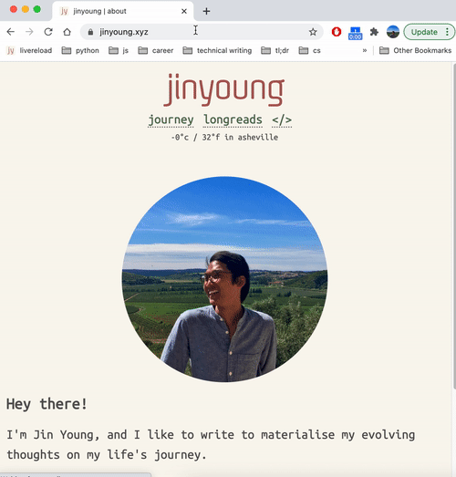

# jinyoung.xyz

**Technologies**: HTML, CSS, SCSS, JavaScript, Jekyll (Ruby, Liquid), OpenWeatherMap API, Netlify

`jinyoung.xyz` is a fully responsive, custom-built portfolio application built on the Jekyll framework. 

[journey](https://jinyoung.xyz/journey) is home to my occasional musings, [longreads](https://jinyoung.xyz/longreads) is my ongoing record of particularly notable endeavours, and [</>](https://jinyoung.xyz/dev) serves as my evolving software engineering portfolio.

[Live Demo](https://jinyoungch0i.github.io/) & [Source Code](https://github.com/jinyoungch0i/jinyoungchoi.github.io)
